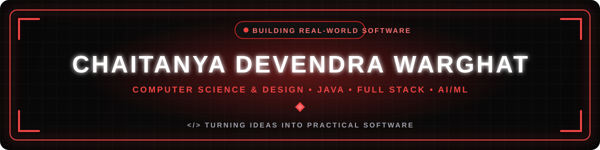
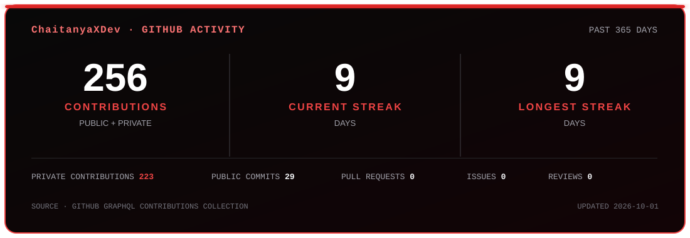

<!--
  Chaitanya Devendra Warghat · GitHub Profile
  Visual system: #0A0A0A / #111111 / #161616 / #DC2626 / #EF4444 / #F3F4F6
-->

  

  
  
  
  
  

  

---

## ◈ About Me

  <b>Computer Science & Design student</b> at <b>YCCE, Nagpur</b>, building toward a strong software-development foundation through <b>Java, full-stack development, DSA, and AI/ML</b>.

  I enjoy turning practical ideas into working software, learning by building, and steadily improving through problem solving.

  
  
  
  

---

## ◈ Featured Projects

<table align="center" width="100%">
  <tr>
    <td width="50%" valign="top" style="padding:16px;">
      <h3>🌾 FarmerSOS</h3>
      
Safety-focused Android application for farmers working alone at night.

      

        
        
        
        
      

      🚨 One-tap SOS · 🐍 Emergency scenarios · 🌡️ Heat support · 📍 Location support · 📡 Poor-network awareness
    </td>
    <td width="50%" valign="top" style="padding:16px;">
      <h3>🏙️ Digital Twin Smart City</h3>
      
Digital Twin simulator focused on SDG 11 and resilient smart-city monitoring.

      

        
        
        
        
      

      🌱 NDVI · 🌫️ AQI · 🌦️ Weather · 📊 SDG 11 Health Score · 🌐 Open-Meteo API
    </td>
  </tr>
  <tr>
    <td width="50%" valign="top" style="padding:16px;">
      <h3>🍲 Seva — Food Donation System</h3>
      
MERN platform connecting food donors with people requesting food.

      

        
        
        
        
      

      🔐 Authentication · 🍱 Donation management · 📋 Request management · 📍 Location-based search
    </td>
    <td width="50%" valign="top" style="padding:16px;">
      <h3>🎓 Internship & Placement Tracker</h3>
      
Web system for managing internship and placement-related information.

      

        
        
        
      

      👨‍🎓 Student functionality · ⚙️ Admin functionality · 🗄️ MySQL-backed web application
    </td>
  </tr>
</table>

---

## ◈ Tech Stack & Skills

<b>Core Programming</b>

  

<b>Frontend & UI</b>

  

<b>Backend</b>

  

<b>Databases</b>

  

<b>Data / AI</b>

  
  
  

<b>Tools</b>

  

---

## ◈ GitHub Activity

  

---

## ◈ Current Focus

  
  
  
  

---

## ◈ LeetCode

<table align="center">
  <tr>
    <td align="center" width="140">
      
    </td>

    <td align="center" width="140">
      
    </td>

    <td align="center" width="140">
      
    </td>

    <td align="center" width="140">
      
    </td>
  </tr>

  <tr>
    <td align="center">
      
    </td>

    <td align="center">
      
    </td>

    <td align="center">
      
    </td>

    <td align="center">
      
    </td>
  </tr>
</table>

 

  <strong>
    BUILDING
    REAL-WORLD SOFTWARE
  </strong>

  CRAFTED WITH CODE • CURIOSITY • CONSISTENCY
   
  © 2026 CHAITANYA DEVENDRA WARGHAT

