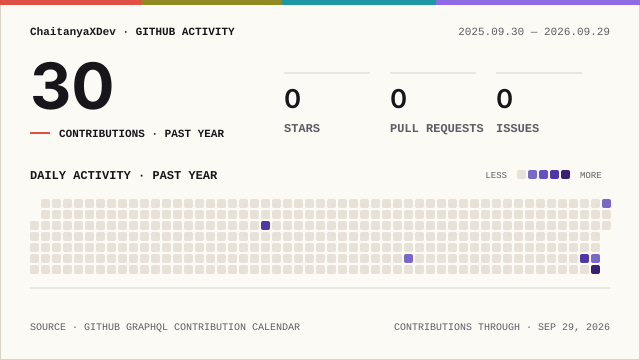

<h1 align="center">Hi 👋, I'm Chaitanya Devendra Warghat</h1>

<h3 align="center">
💻 Computer Science & Design Student • Java & Full-Stack Developer • DSA & AI/ML Enthusiast
</h3>

  

  
  
  
  
  

  

---

## 🧑‍💻 About Me

I'm a <b>Computer Science and Design student</b> at 
<b>Yeshwantrao Chavan College of Engineering (YCCE), Nagpur</b>,
focused on becoming a strong software developer through
<b>DSA, full-stack development, and real-world projects.</b>

I enjoy working with <b>Java, Python, JavaScript, React, Node.js, Spring Boot, MySQL</b>
and exploring <b>AI/ML</b> technologies.

🚀 Building projects • 🧠 Solving DSA problems • 💻 Learning Full Stack • 🎯 Preparing for Placements

---

## 🎓 Education

<b>Yeshwantrao Chavan College of Engineering (YCCE), Nagpur</b> 
B.Tech in Computer Science and Design (CSD) 
2025 – Present • Expected Graduation: 2028

---

## 🚀 Featured Projects

### 🍲 Seva – Food Donation System

A MERN-based platform connecting food donors and people requesting food.

- 🔐 Authentication
- 🍱 Donation management
- 📋 Request management
- 📍 Location-based search

**Tech:** MongoDB • Express.js • React • Node.js

---

## 🧠 DSA & Problem Solving

  <i>Currently strengthening Data Structures & Algorithms for coding interviews and placement preparation.</i>

  

  

---

## 🛠️ Tech Stack

### 💻 Languages

  

### 🌐 Frontend

  

### ⚙️ Backend

  

### 🗄️ Databases

  

### 📊 AI / Data

  

  
  
  

### 🧰 Tools

  

---

## 💼 Internship Experience

### Front-End Web Development Intern
**Microspectra Software Technologies Pvt. Ltd.**

📅 June 2024 – July 2024

Focused on frontend web development and practical development experience.

---

## 🎯 Current Focus

<table align="center">
<tr>
<td align="center" width="220">

🧠  
<b>DSA</b>

Problem Solving & LeetCode

</td>

<td align="center" width="220">

☕  
<b>Java</b>

OOP & Backend Development

</td>

<td align="center" width="220">

🌐  
<b>Full Stack</b>

React + Node + Spring Boot

</td>

<td align="center" width="220">

🤖  
<b>AI / ML</b>

Exploring Intelligent Applications

</td>
</tr>
</table>

---

## 📊 GitHub Activity

  <picture>
    <source
      media="(prefers-color-scheme: dark)"
      srcset="./profile/signal-field-wide-dark.svg"
    />
    
  </picture>

---

## 🐍 Contribution Journey

  

---

## 🌐 Connect With Me

&nbsp;&nbsp;

&nbsp;&nbsp;

&nbsp;&nbsp;

  <i>Building. Learning. Solving. Shipping. 🚀</i>

